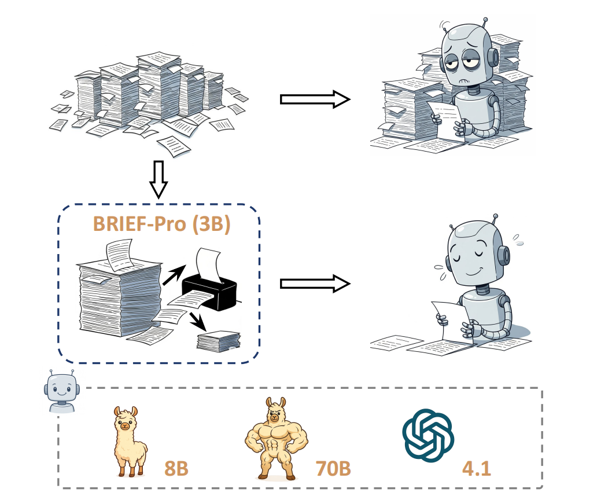
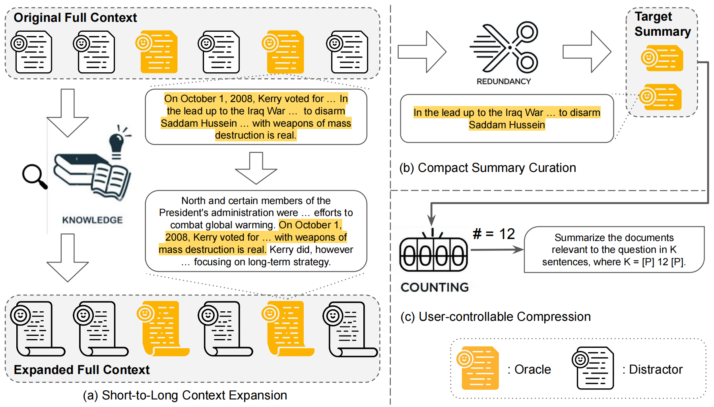

<div align="center">

# BRIEF-PRO: Universal Context Compression with Short-to-Long Synthesis for Fast and Accurate Multi-Hop Reasoning

[Jia-Chen Gu*](https://jasonforjoy.github.io/), [Junyi Zhang*](https://levi-zjy.github.io/), [Di Wu](https://xiaowu0162.github.io/), [Yuankai Li](https://lieziwind.github.io/), [Kai-Wei Chang](http://web.cs.ucla.edu/~kwchang/) and [Nanyun Peng](https://violetpeng.github.io/)

*Equal contribution

[**🌐 Homepage**]() | [**🤗 Model**](https://huggingface.co/uclanlp/brief-pro) | [**🤗 Dataset**](https://huggingface.co/datasets/uclanlp/Brief-Pro) | [**📖 Paper**]()

</div>


## News

We released the training evaluation code, the model checkpoint, and the training data.

## Intro


- BRIEF-PRO. It is a universal, lightweight compressor that distills relevant evidence for a given query from multiple retrieved documents into a concise summary for seamless integration into in-context RAG.
- Given seed data with contexts that are relatively short, each containing fewer than 1k words, BRIEF-PRO is trained towards abstractively condensing long contexts of 10k+ words across diverse scenarios.
- Furthermore, BRIEF-PRO offers flexible user control over the length of the output summary by allowing users to specify the desired number of sentences.


<p align="center">
  </a> <br>
</p>


- The overview of the synthetic data pipeline for training BRIEF-PRO is as follows. Starting with a mixture of oracle and distractor documents for a given query, the pipeline: (a) expands each document by looking up an external knowledge corpus, (b) curates a compact summary by further reducing redundancy in the oracle documents, and (c) generates a user-controllable compression instruction by counting the number of sentences in the compact summary.


<p align="center">
  </a> <br>
</p>


## Training 

- Follow the instructions on the [Axolotl website](https://github.com/axolotl-ai-cloud/axolotl) to set up the training environment.

- Then run the following command to start training:


  ```
  bash ./BRIEF-Pro/train/Axolotl/examples/llama-3.2/test3.sh
  ```

## Evaluation 

- Run the following command to for evaluation:
  

  ```
  bash ./BRIEF-Pro/BRIEF/BRIEF-Pro/eval/test_pipe_testAll_UserControl.sh
  bash ./BRIEF-Pro/BRIEF/BRIEF-Pro/eval/test_pipe_testSealQA_UserControl.sh
  ```


## Citation

